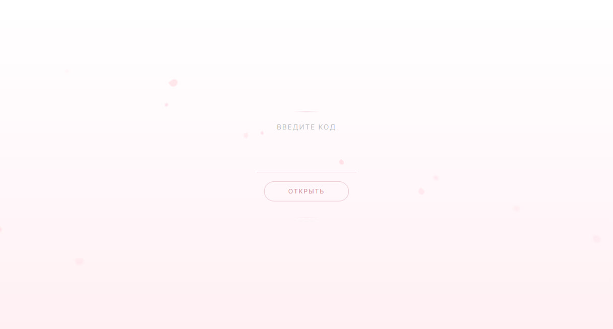

# 8 Марта — Персональные поздравления

Анимированный сайт с персональными поздравлениями к 8 Марта. Каждая получательница вводит уникальный код и видит личное поздравление с её именем, аватаром и текстом. Анимация цветочного поля, падающие лепестки и пословное появление текста.

<p align="center">
  <a href="https://vovchensky.github.io/march-8/">
    
  </a>
</p>

## Демо

**[https://vovchensky.github.io/march-8/](https://vovchensky.github.io/march-8/)**

## Запуск

```bash
npm install
npm run dev
```

## Сборка

```bash
npm run build
```

## Технологии

- React 19, TypeScript
- Framer Motion (анимации цветов, лепестков, текста)
- Vite
- SVG-генерация цветов с градиентами
- Адаптивный дизайн (мобильная версия с волнами вместо цветочного поля)
